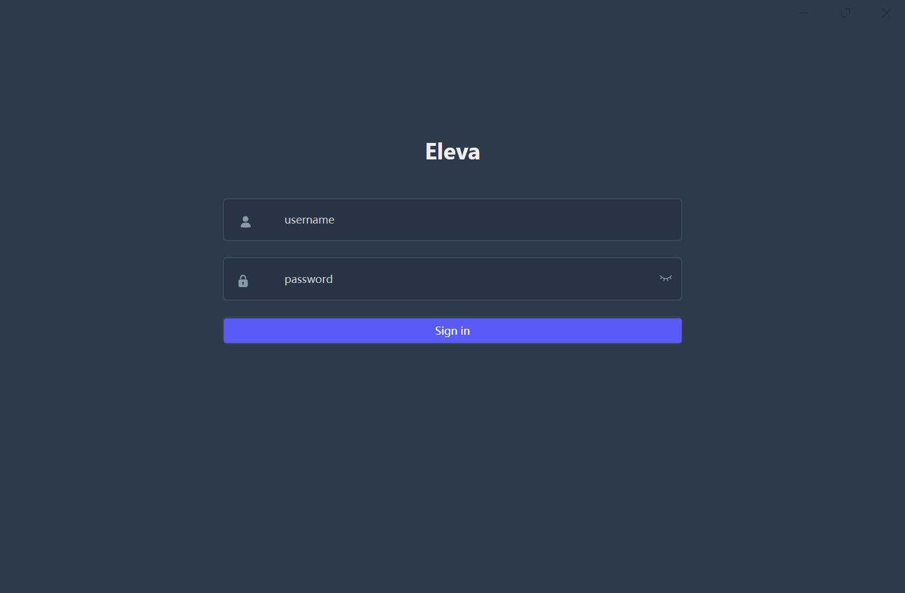
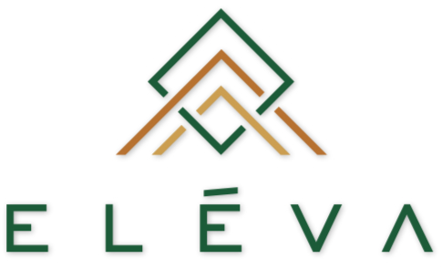
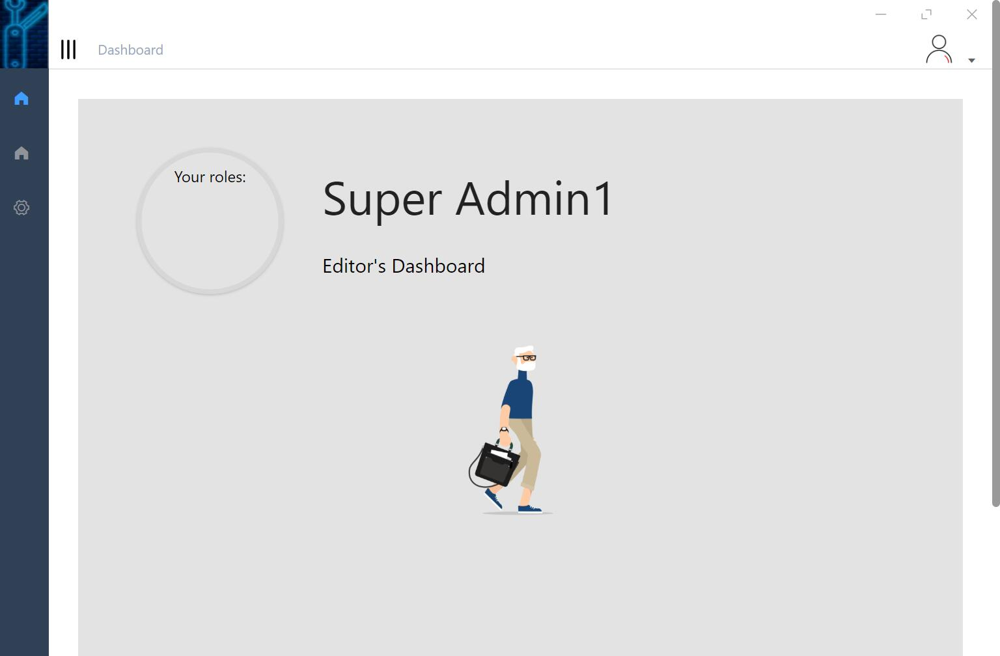

# Eleva

 A GUI development framework, Electron based element-vue-admin skeleton.

 ## Release note
  - v0.1.1: Eleva a electron element-vue-admin basic framework.


Eleva
==========
> A Electron based app skeleton based on [Electron-VUE](https://github.com/SimulatedGREG/electron-vue) and [Motrix](https://github.com/agalwood/Motrix)


> [Guide doc](TODO)

 What is it:
 -----------

We integrated with those technical and refer [Motrix](https://github.com/agalwood/Motrix) to build a more easy startup skeleton framework about Electron.

- Eleva =electron + element + VUE + element-VUE-Admin-UI
- [Electron](https://www.electronjs.org/).  Build cross-platform desktop apps with Javascript, HTML, and CSS
- [Element](https://element.eleme.cn/#/en-US) A Desktop UI library
- [VUE-Element-Admin](https://panjiachen.github.io/vue-element-admin-site/)


> UI a glance








Features
--------
 - Electron
 - VUE
 - VUE-Element-Admin
 - Auto upgrade
 - NeDB (TODO)
 - Electron-router (TODO)


Depends on:
-----------

- Electron
- VUE
- NeDB
- Element


# Deployment and Open source:


## Deployed it into npmjs:

## Deploy and install:
 - TODO

- docsify

 Running up dosify by command
```linux
$ docsify serve ./docs/
```
